## Chapter 9. Mathmatical Tools

本章介绍在金融领域几款实用的数学工具，但不会详细介绍它们的背景，而只是针对它们的应用做些
描述，主要包括：

- Approximation: 金融领域里面应用最多的回归和插值处理。
- Convex optimization: 许多金融训练所需要的凸面优化。
- Integration: 金融资产（衍生品）评估常使用的评估积分。
- Symbolic mathematics: Python提供强有力的工具库SysPy来完成公式所涉及的数学符号运算。

### Approximation

#### 1 Regression / 回归

函数近似值的模拟通常采用多项式来模拟，即所谓的Regression（回归），其公式如下：

![minimization_problem_equation.png]

1) Monomials as basis functions / 将单项式作为基础函数

NumPy的内建函数polyfit用来决定最优化参数，polyval用来对一些输入值进行近似估值。比如通过
polyfit可以获取最优系数集合p， 然后通过polyval(p, x)可以求取相当于x坐标值的回归值（对应
y坐标的值）。

```
def f(x):
    return np.sin(x) + 0.5*x

x = np.linspace(-2*np.pi, 2*np.pi, 50)

# 获取函数 f(x) 的最优系数，这个系数对整个函数通用。
# 由于此时指定了 degree = 1，那么也即是说多项式只有2项，对应系数为2。
reg = np.polyfit(x, f(x), deg=1)

# 根据最有系数，使用不同的x值进行回归计算。
ry = np.polyval(reg, x)

#plt.rc('grid', linestyle="--", color='black')
plt.plot(x, f(x), 'b', label='f(x)')
plt.plot(x, ry, 'r.', label='regression')
```

如上这段代码采用 degree = 1估值的效果如下，degree = 1为线性回归，所以可以看到它无法：

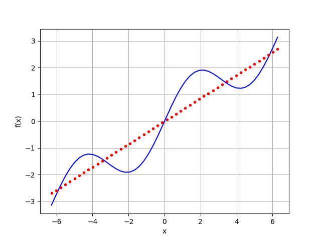

当我们将 degree 调整为5，便可以看到明显的变化：

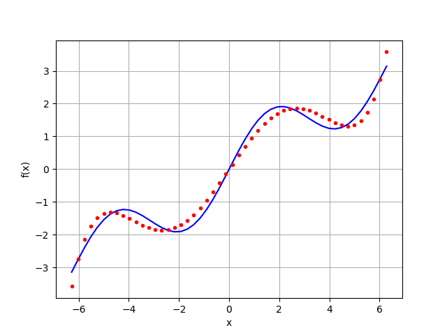

当我们将 degree 调整为7，基本可以看到完美的拟合了。不过当我们通过`np.allclose(f(x), ry)`
去判断两者是否相等时可以发现它们之间依然存在有较大的误差（大于1e-05）。求取两者的均方误差
为0.00177，并不是太大。（注：均方误差体现的是数据序列与真实值之间的关系，公式为`np.sum((f(x) - ry) ** 2) / len(x)`）

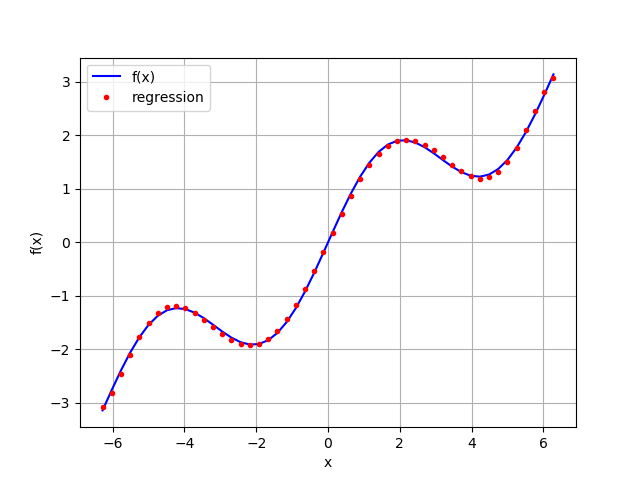


参考：

- [](https://zhuanlan.zhihu.com/p/34000100)

2) Individual basis functions / 独立基础函数

另一种改善regression结果的方法是使用独立的基础函数，这种情况下需要使用到矩阵。比如以幂高
为3创建一个矩阵：

```
matrix = np.zeros((3 + 1, len(x)))
matrix[3, :] = x ** 3
matrix[2, :] = x ** 2
matrix[1, :] = x
matrix[0, :] = 1
```

再通过`np.linalg.lstsq`获取最佳二乘法的解，再用`np.dot(a, b)`求取点积，绘制图形如下：


由于看起来差别较大，因此我们尝试将其基本函数替换为包含sin(x)，便能达到更加理想的效果。

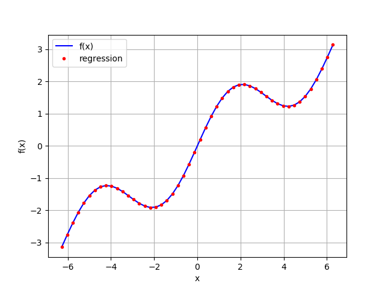

3) Noisy data

回归能够很好地应对噪声，噪声通常来自是模拟数据或者不理想的测量数据。如下的测试里面分别为
原始的x坐标值和y坐标值均添加了噪声，可以看到噪声数据与原始数据相比存在有一定的失真，但回
归得到值更加接近原始数据。

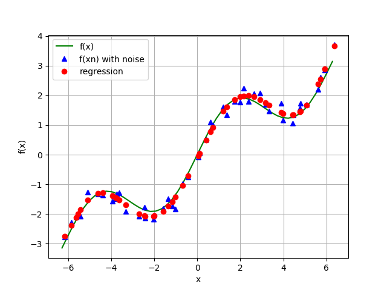

4) Unsorted data

回归也能够很好地处理无序数据。


5) Multiple dimensions

最小二乘法回归不需要经过太多修改就能够满足的多元函数的回归。

发现这个例子里面有错误，比如代码里` fig.colorbar(surf, shrink=0.5, aspect=5)`根本没有
定义surf。

最小二乘法回归模型有着多方面的应用，包括求取简单函数最佳函数匹配，以及基于噪声和无序数据
的最佳匹配函数。这些模型可以方便地应用在单维和多维数据上。

#### 2 Interpolation / 插值

插值相比回归更频繁地应用在数学当中，但它也同样只用来解决低维的问题。插值的基本思想是在两
个相邻的数据点找到最为理想化的新点使之能够很好地进行回归。高连续性的插值需要更为高阶的插
值函数。

如下是基于如上例子进行的样条插值，也有不错的效果：

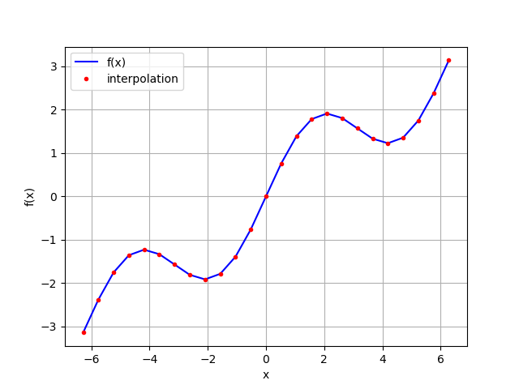

样条插值通常在金融里用来对新的观测点进行预估。如果我们将观测值的间隔缩小，再进行插值处理，
我们能够看到新的插值不能够做到足够连续，这是线性插值的一个缺点。

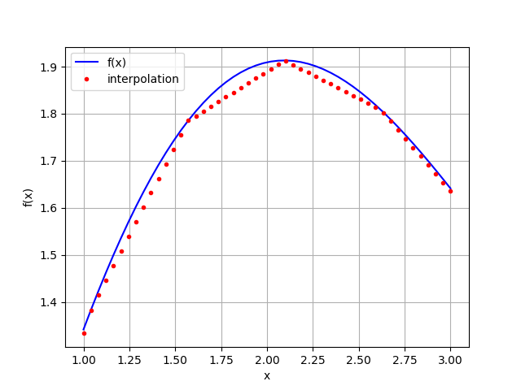

我们将其修改为立方插值，则有更好的效果：

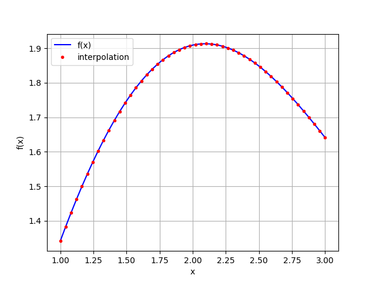

插值拥有比最小二乘法回归更好的结果，但只能够对有序的，并且无噪声的数据进行插值，并且插值
也只适合低维的数据。

#### 3 Convex Optimization / 凸规划

凸规划在金融和经济领域有着极其重要的作用，比如根据市场数据来对期权定价模型进行校准。如下
是一个二元二次函数生成的例子，从图形里面可以看到多个最小值：

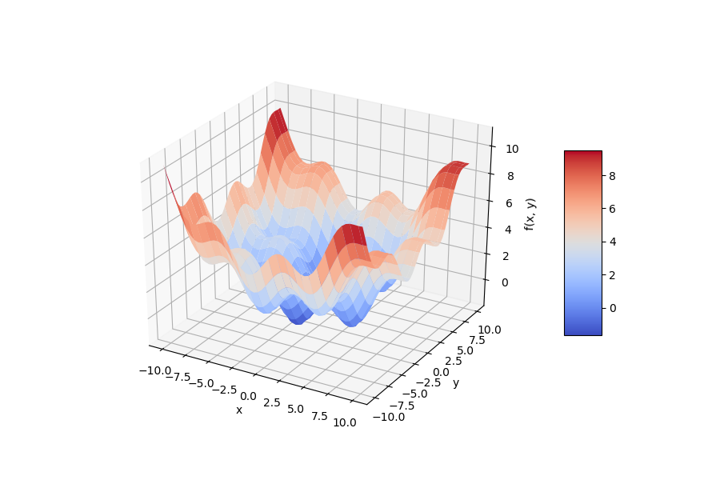

接下来我们需要找到global和local的最小值求法。

1) GLOBAL OPTIMIZATION

求取全局的最小值需要使用`brute`函数。

2) LOCAL OPTIMIZATION

对于大多数凸规划问题，通常在进行local规划之前先应进行global规划。

3) CONSTRAINED OPTIMIZATION

到当前我们讨论的均是没有约束的优化问题。然而，大部分的金融或者经济问题都与多个约束相关，
这些约束能够用等式或者不等式进行表达。

例如，考虑如下一个有关投资的最大效用问题：投资者能够投资两种风险证券，成本价分别为qa,qb。
对于情况u，一年之后它们能够分别获取15美元和5美元的回报。对于情况d，它们分别对应5美元和12
美元的回报。如上两种情况概率相同。用一个(ra, rb)的向量来表示两种证券的回报率。

投资者拥有100美元的预算，可以通过函数u(w) = sqrt(w)来推算未来收益，其中w是可用的资金，
那么下面的公式对应一个最大值问题，其中a和b表示投资者购买的两种证券的份额。

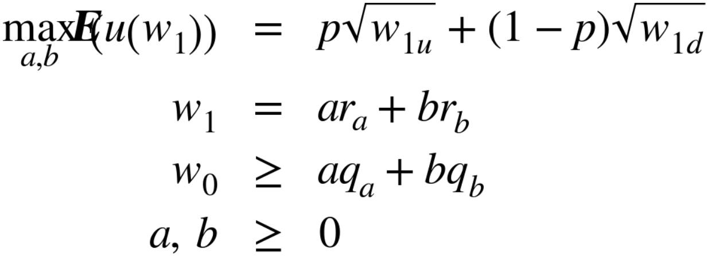

这个公式我是这样理解的：

- W0是初始时的资金。
- W1是投资的资金情况，W1u表示情况u时的投资额，W1d表示情况d时的投资额。
- p是u情况发生的概率，(1-p)是d情况发生的概率。

因此整个公式是计算该投资的期望值，其问题也是求解最大的期望值。由于a和b的概率相等，所以上
面的式子可以变为最小值问题：

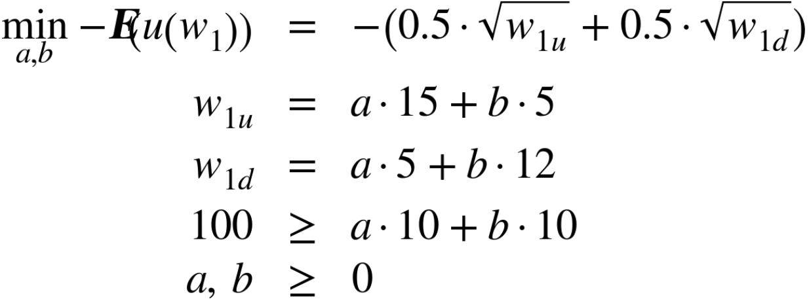

之后通过调用`minimize`来获取最小值，得到投资者购买8单位的a证券和2单位的b证券可以获得最大
值9.7。（代码尚未调试通过）

#### 4 Integration / 积分

Integration在估值和期权定价上非常有用。比如我们要对函数 sin(x) + 0.5*x 在区间[0.5, 9.5]
进行积分:

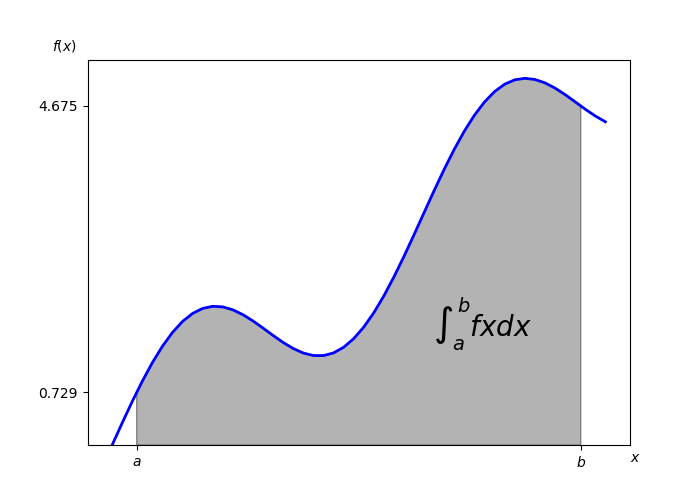

1) Numerical Integration

integrate 模块提供了专门的数值积分函数，比如quad 来负责自适应正交积分，romberg 负责龙贝
积分。

2) Integration by Simulation
