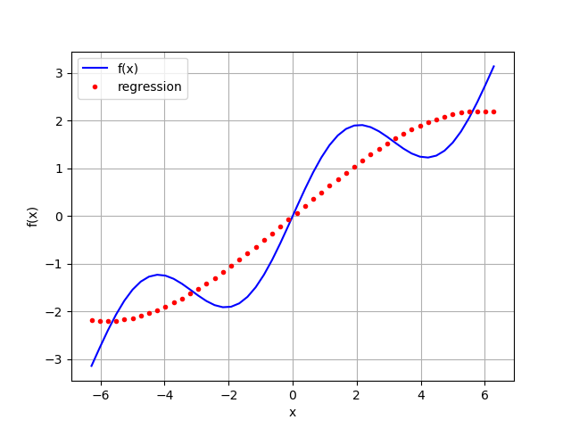
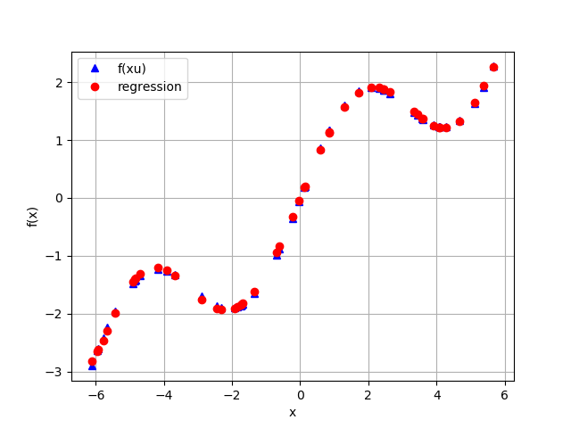

## Chapter 9. Mathmatical Tools

本章介绍在金融领域几款实用的数学工具，但不会详细介绍它们的背景，而只是针对它们的应用做些
描述，主要包括：

- Approximation: 金融领域里面应用最多的回归和插值处理。
- Convex optimization: 许多金融训练所需要的凸面优化。
- Integration: 金融资产（衍生品）评估常使用的评估积分。
- Symbolic mathematics: Python提供强有力的工具库SysPy来完成公式所涉及的数学符号运算。

### Approximation

#### 1 Regression

函数近似值的模拟通常采用多项式来模拟，即所谓的Regression（回归），其公式如下：

![minimization_problem_equation.png]

1) Monomials as basis functions / 将单项式作为基础函数

NumPy的内建函数polyfit用来决定最优化参数，polyval用来对一些输入值进行近似估值。比如通过
polyfit可以获取最优系数集合p， 然后通过polyval(p, x)可以求取相当于x坐标值的回归值（对应
y坐标的值）。

```
def f(x):
    return np.sin(x) + 0.5*x

x = np.linspace(-2*np.pi, 2*np.pi, 50)

# 获取函数 f(x) 的最优系数，这个系数对整个函数通用。
# 由于此时指定了 degree = 1，那么也即是说多项式只有2项，对应系数为2。
reg = np.polyfit(x, f(x), deg=1)

# 根据最有系数，使用不同的x值进行回归计算。
ry = np.polyval(reg, x)

#plt.rc('grid', linestyle="--", color='black')
plt.plot(x, f(x), 'b', label='f(x)')
plt.plot(x, ry, 'r.', label='regression')
```

如上这段代码采用 degree = 1估值的效果如下，degree = 1为线性回归，所以可以看到它无法：


当我们将 degree 调整为5，便可以看到明显的变化：


当我们将 degree 调整为7，基本可以看到完美的拟合了。不过当我们通过`np.allclose(f(x), ry)`
去判断两者是否相等时可以发现它们之间依然存在有较大的误差（大于1e-05）。求取两者的均方误差
为0.00177，并不是太大。（注：均方误差体现的是数据序列与真实值之间的关系，公式为`np.sum((f(x) - ry) ** 2) / len(x)`）


参考：

- [](https://zhuanlan.zhihu.com/p/34000100)

2) Individual basis functions / 独立基础函数

另一种改善regression结果的方法是使用独立的基础函数，这种情况下需要使用到矩阵。比如以幂高
为3创建一个矩阵：

```
matrix = np.zeros((3 + 1, len(x)))
matrix[3, :] = x ** 3
matrix[2, :] = x ** 2
matrix[1, :] = x
matrix[0, :] = 1
```

再通过`np.linalg.lstsq`获取最佳二乘法的解，再用`np.dot(a, b)`求取点积，绘制图形如下：



由于看起来差别较大，因此我们尝试将其基本函数替换为包含sin(x)，便能达到更加理想的效果。


3) Noisy data

回归能够很好地应对噪声，噪声通常来自是模拟数据或者不理想的测量数据。如下的测试里面分别为
原始的x坐标值和y坐标值均添加了噪声，可以看到噪声数据与原始数据相比存在有一定的失真，但回
归得到值更加接近原始数据。


4) Unsorted data

回归也能够很好地处理无序数据。



5) Multiple dimensions

最小二乘法回归不需要经过太多修改就能够满足的高阶函数的回归。


#### 2 Interpolation
