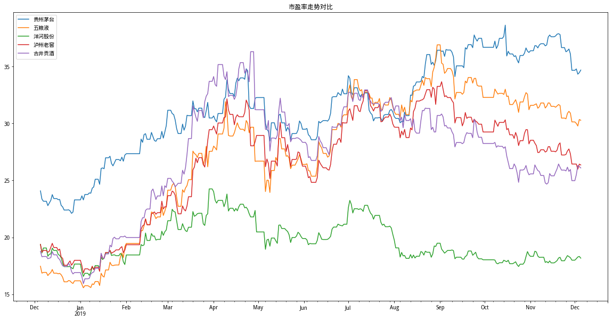

# 第二周周记：获取多只股票市盈率

## 一、`获取多只股票市盈率`代码解释

```
import pandas as pd

stock_list = ['贵州茅台', '五粮液', '洋河股份', '泸州老窖', '古井贡酒']
stocks_df = get_all_securities()
stock_code_list = [stocks_df[stocks_df['display_name'] == stock].index.item() for stock in stock_list]

days = pd.date_range(start = '2018-12-05', end = '2019-12-05')
multi_pe_ratio = {}
for i in range(len(stock_list)):
    stock_code = stock_code_list[i]
    stock_name = stock_list[i]
    q = query(valuation.day, valuation.code, valuation.pe_ratio).filter(valuation.code == stock_code)
    pe_ratio = [get_fundamentals(q, date = day).loc[0, 'pe_ratio'] for day in days]
    multi_pe_ratio[stock_name] = pe_ratio

df = pd.DataFrame(multi_pe_ratio)
df.index = days
df.plot(figsize = (20, 10))
```

效果图如下：



**代码片段一：**

```
import pandas as pd

stock_list = ['贵州茅台', '五粮液', '洋河股份', '泸州老窖', '古井贡酒']
stocks_df = get_all_securities()
stock_code_list = [stocks_df[stocks_df['display_name'] == stock].index.item() for stock in stock_list]
```

上面这部分代码在[上周的周记](https://www.joinquant.com/view/community/detail/4298dffa265ff07fd52aa2dbcd9fe577)已经讲过，简而言之第一句是Python编程里面的准备工作，把程序里需要使用的模块包含进来；剩下的部分是将股票名称转换为对应的股票代码，因为聚宽提供的服务函数只接收股票代码。

**代码片段二：**

```
days = pd.date_range(start = '2018-12-05', end = '2019-12-05')
multi_pe_ratio = {}
for i in range(len(stock_list)):
    stock_code = stock_code_list[i]
    stock_name = stock_list[i]
    q = query(valuation.day, valuation.code, valuation.pe_ratio).filter(valuation.code == stock_code)
    pe_ratio = [get_fundamentals(q, date = day).loc[0, 'pe_ratio'] for day in days]
    multi_pe_ratio[stock_name] = pe_ratio
```

代码里面有关字典`multi_pe_ratio`的存在是为了把不同的股票市盈率按照股票名称作为键值保存下来，这样便于之后直接通过字典来创建DataFrame。剩下的部分有两个地方需要详解：1，query对象；2，get_fundamentals函数。

1.query对象

要认识query对象先必须要认识SQLAlchemy ORM，因为query对象是SQLAlchemy ORM的操作对象，但是在这之前必须要先将SQLAlchemy ORM拆分为两段进行解释：`SQLAlchemy`是一个用来支持Python与数据库之间进行交互的工具包，它包括两个部分`SQLAlchemy ORM`和`SQLAlchemy Core`两部分，SQLAlchemy ORM简称ORM(Object Relational Mapper)在Python的类与数据库中的表之间建立了连接，使得用户可以像操作Python类那样完成数据库的访问工作。简单来说SQLAlchemy ORM是一个用来便捷访问数据库的函数库，层次高，用得爽。

那么[query对象](https://docs.sqlalchemy.org/en/13/orm/query.html#sqlalchemy.orm.query.Query)就是ORM里面专门用于查询功能的对象。我们只需要按照规则写一句`query(valuation.day, valuation.code, valuation.pe_ratio).filter(valuation.code == stock_code)`之后的工作就交给`SQLAlchemy ORM`，执行时它可能要将其转换为很多句SQL语句来完成数据库的查询，上面这句查询条件的意思是“查询对应股票的市值表，同时过滤出查询的日期、股票代码和股票当日的市盈率”。

在理解query对象之后，我发现上面的query对象的那条语句实际上可以简化：`q = query(valuation.day, valuation.code, valuation.pe_ratio).filter(valuation.code == stock_code)`可以简化为`q = query(valuation.pe_ratio).filter(valuation.code == stock_code)`，因为我们当前仅仅对市盈率感兴趣。

参考：

- [SQLAlchemy Overview](https://docs.sqlalchemy.org/en/13/intro.html)
- [Constructing Database Queries with SQLAlchemy](https://hackersandslackers.com/database-queries-sqlalchemy-orm/)
- [The Query Object](https://docs.sqlalchemy.org/en/13/orm/query.html#the-query-object)

2.get_fundamentals函数

聚宽提供的查询财务数据的函数`get_fundamentals()`规定了必须要接收query对象，因此在此之前我们必须要将我们自己的查询请求初始化成一个query对象，再调用`[get_fundamentals(q, date = day).loc[0, 'pe_ratio'] for day in days]`，这句代码看起来简单，但实际上包括了三个方面的知识点：

- get_fundamentals()函数调用：获取某天的市值数据，结果为DataFrame类型，也就是一种二维表数据类型。
- 针对调用结果（DataFrame类型）的数据获取，即`dataframe.loc[x,y]`：从DataFrame类型里面获取pe_ratio字段。
- Python所支持的快速创建新列表的方法——列表解析，即`[ function(day) for day in days]`：循环执行所有查询日期。

**代码片段三：**

```
df = pd.DataFrame(multi_pe_ratio)
df.index = days
df.plot(figsize = (20, 10))
```

基于Python字典创建的DataFrame，改写DataFrame数据的index(行标签)，再调用DataFrame的`plot()`函数画图。


## 二、上周遗留问题

### 1.如何处理获取多只股票行情数据时返回的经过"堆叠"的DataFrame（stacked data）

> 问题描述：上周提到的使用`get_price()`时传入股票列表所返回的Pandas中的三维数据类型Panel在Pandas 0.25.0之后就过时了，所以不建议继续使用。在调用该函数的时候也可以直接设定`panel=Fase`，这个时候获取到的结果也是DataFrame，但我们需要将其进行进一步处理来满足需求，这个主题我会在下周学习。


当我们设定`panel=True`的时候，在输出三维数据的时候仅仅打印出三个坐标轴的信息，如下：

```
p = get_price(stock_code_list, start_date, end_date, 'daily', 'close', panel=True)
p['close']

# 输出：

<class 'pandas.core.panel.Panel'>
Dimensions: 1 (items) x 4 (major_axis) x 5 (minor_axis)
Items axis: close to close
Major_axis axis: 2019-12-02 00:00:00 to 2019-12-05 00:00:00
Minor_axis axis: 600519.XSHG to 000596.XSHE
```

对于三维数据的访问我们可以通过指定坐标轴0（即Items轴）索引即可以返回对应的DataFrame数据，于是通过`p[close]`我们可以得到多只股票对应的收盘价:

```
           600519.XSHG  000858.XSHE     ...       000568.XSHE  000596.XSHE
2019-12-02      1133.00       127.00     ...             81.74       110.43
2019-12-03      1118.00       126.04     ...             80.36       113.90
2019-12-04      1122.33       128.45     ...             81.72       113.50
2019-12-05      1129.80       128.16     ...             81.49       113.00
```


由于Pandas中的Panel类型在版本0.25.0之后过时废弃了，我们在调用`get_price()`获取多标数据的时候要设定`panel=False`。这个时候它返回的结果是DataFrame的类型，但返回的DataFrame数据是以不同的股票收盘价堆叠形成的：

```
df = get_price(stock_code_list, '2019-12-02', '2019-12-05', 'daily', 'close', panel=False)
print (df)

# 输出：

         time         code    close
0  2019-12-02  600519.XSHG  1133.00
1  2019-12-03  600519.XSHG  1118.00
2  2019-12-04  600519.XSHG  1122.33
3  2019-12-05  600519.XSHG  1129.80
4  2019-12-02  000858.XSHE   127.00
5  2019-12-03  000858.XSHE   126.04
6  2019-12-04  000858.XSHE   128.45
7  2019-12-05  000858.XSHE   128.16
8  2019-12-02  002304.XSHE    98.90
9  2019-12-03  002304.XSHE    99.72
10 2019-12-04  002304.XSHE    99.98
11 2019-12-05  002304.XSHE    99.16
12 2019-12-02  000568.XSHE    81.74
13 2019-12-03  000568.XSHE    80.36
14 2019-12-04  000568.XSHE    81.72
15 2019-12-05  000568.XSHE    81.49
16 2019-12-02  000596.XSHE   110.43
17 2019-12-03  000596.XSHE   113.90
18 2019-12-04  000596.XSHE   113.50
19 2019-12-05  000596.XSHE   113.00
```

至于什么叫做“堆叠”的数据，我简单的画了个图来帮助理解，但不保证我现在的理解没有偏差：


那怎样能够让这些被堆叠的数据转化为上图左边我们想要的样子呢？这个时候就要使用数据透视功能了（在EXCEL里面也有这个功能）。

```
df = get_price(stock_code_list, '2019-12-02', '2019-12-05', 'daily', 'close', panel=False)
pivot_df = df.pivot(index='time', columns='code', values='close')
print (pivot_df)

# 输出：
code        000568.XSHE  000596.XSHE     ...       002304.XSHE  600519.XSHG
time                                     ...                               
2019-12-02        81.74       110.43     ...             98.90      1133.00
2019-12-03        80.36       113.90     ...             99.72      1118.00
2019-12-04        81.72       113.50     ...             99.98      1122.33
2019-12-05        81.49       113.00     ...             99.16      1129.80
```

这样就解决了最初的问题。对于数据透视的功能，刚好又是本周学习的另外一个主题，下面有总结。

### 2.Pandas中的pivot table

> 问题描述：宽友 @jqz1226 在[《再谈获取多只股票的市盈率—极速版》](https://www.joinquant.com/view/community/detail/24517)改进过我发布的[价值研究笔记之获取多只股票的市盈率](https://www.joinquant.com/view/community/detail/97ac84a17f7e9da63be455ac8df30971)，迭代出两个新的版本，其中使用到了Padans的数据透视表，这是我没有学习到的内容，因此计划本周进行学习。

其实DataFrame的数据透视功能再解决上面那个多标数据问题时已经使用到了，使用的方式也很简单，即为透视对象指定新的index, column和value。这个“透视过程”其实就是基于一个DataFrame来形成另一个DataFrame的过程。以下是针对数据透视功能的进一步介绍，主要参考Pandas官方文档[Reshaping and pivot tables](https://pandas.pydata.org/pandas-docs/stable/user_guide/reshaping.html)部分。

数据在很多时候是按照“堆叠”的方式（stacked/record）存储，比如下面这种形式，对于data和variable列来说它们都有重复的条目：

```
   date       variable     value
0  2000-01-03        A  0.469112
1  2000-01-04        A -0.282863
2  2000-01-05        A -1.509059
3  2000-01-03        B -1.135632
4  2000-01-04        B  1.212112
5  2000-01-05        B -0.173215
6  2000-01-03        C  0.119209
7  2000-01-04        C -1.044236
8  2000-01-05        C -0.861849
9  2000-01-03        D -2.104569
10 2000-01-04        D -0.494929
11 2000-01-05        D  1.071804
```

而DataFrame的`pivot()`可以基于这些数据形成新的视图，这个过程我们可以称为“数据透视”。比如我们可以将`data列的内容`作为新的index，将`variable列的内容`作为新的columns，将`value列的内容`作为新的值，可以这么做：

```
pivot = df.pivot(index='date', columns='variable', values='value')
print(pivot)

输出为：
variable           A         B         C         D
date                                              
2000-01-03  0.469112 -1.135632  0.119209 -2.104569
2000-01-04 -0.282863  1.212112 -1.044236 -0.494929
2000-01-05 -1.509059 -0.173215 -0.861849  1.071804
```

理解了这个例子，也就能够很好地理解我们该如何处理使用聚宽函数`get_price()`传入股票列表得到的多标数据了。

参考：

- [Reshaping and pivot tables](https://pandas.pydata.org/pandas-docs/stable/user_guide/reshaping.html)


## 三、本周学习到的知识点

### 1.Pandas中的Panel类型[Panel](https://pandas.pydata.org/pandas-docs/version/0.24/reference/panel.html)简介

在Pandas的数据类型中`Series`是一维的，`DataFrame`是二维的，即数据表的形式，而`Panel`则是一种三维的数据类型。这种三维的数据类型使用3个坐标轴来支持数据的索引：

- items，坐标轴0，每个条目对应不同的DataFrame。
- major_axis，坐标轴1，每个条目对应DataFrame的行（index）。
- minor_axis，坐标轴2，每个条目对应DataFrame的列（column）。

它同时提供一些列的方法来帮助操作数据，但这种类型从Pandas 0.25.0版本之后已经被正式移除，所以不再进一步学习和关注。

参考：

- [Panel(面板)数据结构](https://www.cnblogs.com/JeremyTin/p/5324536.html)
- [Panel](https://pandas.pydata.org/pandas-docs/version/0.24/reference/panel.html)


### 2.聚宽服务函数`get_fundamentals_continuously()`, `get_valuation`

> 宽友 @jqz1226 在[《再谈获取多只股票的市盈率—极速版》](https://www.joinquant.com/view/community/detail/24517)改进过我另外一篇[价值研究笔记之获取多只股票的市盈率](https://www.joinquant.com/view/community/detail/97ac84a17f7e9da63be455ac8df30971)，迭代出两个新的版本中使用到了新的`get_fundamentals_continuously()`, `get_valuation`的新用法，我读到了。

在开头获取多只股票在某段时间里的市盈率的时候，写了两层循环调用`get_fundamentals()`来分次获取，效率很低。之后经过@jqz1226的发现才知道原来在阅读聚宽提供服务函数的时候，[聚宽帮助页面的API文档](https://www.joinquant.com/help/api/help?name=api#%E6%95%B0%E6%8D%AE%E8%8E%B7%E5%8F%96%E5%87%BD%E6%95%B0)一定不能错过，因为其中可能掩藏着更多效率更高的函数。

`get_fundamentals_continuously()`就是可以用来优化以上代码的第一个函数，有了它上面`代码片段二`中的8行代码可以简化为如下的3行：

```
q = query(valuation.pe_ratio).filter(valuation.code.in_(stock_code_list))
pe_ratio = get_fundamentals_continuously(q, end_date='2019-12-05', count=100, panel=False)
pivot = pe_ratio.pivot(index='day', columns='code', values='pe_ratio')
```

另外一个更好用的是`get_valuation()`，用来获取多个标的在指定交易日范围内的市值表数据。有了它你甚至连query对象的创建都省了，所以上面的3行可以变为如下2行：

```
pe_ratio = get_valuation(stock_code_list, start_date='2018-12-05', end_date='2019-12-05', fields='pe_ratio')
pivot = pe_ratio.pivot(index='day', columns='code', values='pe_ratio')
```

确实棒棒哒，感谢 @jqz1226 的提点！

### 3.基金数据的获取

本周尝试获取基金数据，可以获取基金历史走势的净值数据，目前还在思考如何进一步对获取到的数据进行整理，以方便获取某段时间内表现最优异的ETF基金。


## 下周主题

### 1.比较基金数据

尝试对获取到的基金数据进行整理，大致思路是获取到市场上一段时间内所有ETF基金的净值数据，从中选出表现最优异的三只ETF基金。目前基金数据的整理可能不是难点，难点在于如何根据`基金单位净值`和`基金累计净值`去评判一直基金的好坏。

### 2.开始了解聚宽因子

虽然我当前主要是从价值投资的角度来分析股票，对于量化投资并未开始涉猎。但本周逛社区的时候，看到宽友建议先了解下因子，我看了下相关的学习链接，发现内容不少，只能先逐步投入时间了解，但估计目前不会太深入学习，时间不够用呀。

- [因子分析 API](https://www.joinquant.com/help/api/help?name=factor)
- [量化投资-单因子分析精讲](https://ke.qq.com/course/394206)
