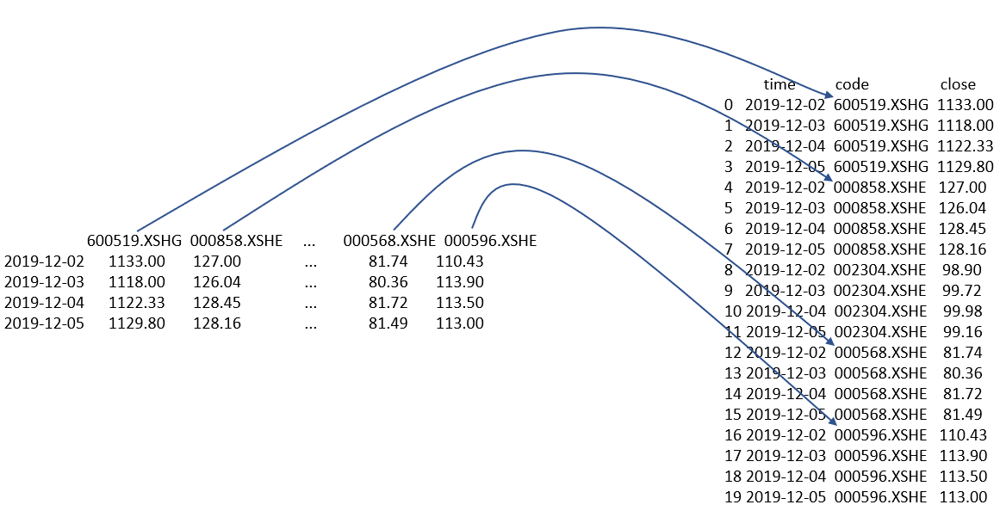

# 第二周周记：获取多只股票市盈率

## 一、笔记代码解释

```
import pandas as pd

stock_list = ['贵州茅台', '五粮液', '洋河股份', '泸州老窖', '古井贡酒']
stocks_df = get_all_securities()
stock_code_list = [stocks_df[stocks_df['display_name'] == stock].index.item() for stock in stock_list]

days = pd.date_range(start = '2018-12-05', end = '2019-12-05')
multi_pe_ratio = {}
for i in range(len(stock_list)):
    stock_code = stock_code_list[i]
    stock_name = stock_list[i]
    q = query(valuation.day, valuation.code, valuation.pe_ratio).filter(valuation.code == stock_code)
    pe_ratio = [get_fundamentals(q, date = day).loc[0, 'pe_ratio'] for day in days]
    multi_pe_ratio[stock_name] = pe_ratio

df = pd.DataFrame(multi_pe_ratio)
df.index = days
df.plot(figsize = (20, 10))
```

效果图如下：


**代码片段一：**

```
import pandas as pd

stock_list = ['贵州茅台', '五粮液', '洋河股份', '泸州老窖', '古井贡酒']
stocks_df = get_all_securities()
stock_code_list = [stocks_df[stocks_df['display_name'] == stock].index.item() for stock in stock_list]
```

上面这部分代码在[上周的周记](xxx)已经讲过，简而言之第一句是Python编程里面的准备工作，把程序里需要使用的模块包含进来；剩下的部分是将股票名称转换为对应的股票代码，因为聚宽提供的服务函数只接收股票代码。


**代码片段二：**

```
days = pd.date_range(start = '2018-12-05', end = '2019-12-05')
multi_pe_ratio = {}
for i in range(len(stock_list)):
    stock_code = stock_code_list[i]
    stock_name = stock_list[i]
    q = query(valuation.day, valuation.code, valuation.pe_ratio).filter(valuation.code == stock_code)
    pe_ratio = [get_fundamentals(q, date = day).loc[0, 'pe_ratio'] for day in days]
    multi_pe_ratio[stock_name] = pe_ratio
```

代码里面有关字典`multi_pe_ratio`的存在和上周周记里面的一样，是为了把不同的股票市盈率按照股票名称作为键值保存下来，这样便于之后直接通过字典来创建DataFrame。剩下的部分有两个地方需要详解：1，query对象；2，get_fundamentals函数。

1.query对象

要认识query对象先必须要认识SQLAlchemy ORM，因为query对象是SQLAlchemy ORM的操作对象，但是在这之前必须要先将SQLAlchemy ORM拆分为两段进行解释：


参考：

- [Constructing Database Queries with SQLAlchemy](https://hackersandslackers.com/database-queries-sqlalchemy-orm/)
- [The Query Object](https://docs.sqlalchemy.org/en/13/orm/query.html#the-query-object)

2.get_fundamentals函数


**代码片段三：**

```
df = pd.DataFrame(multi_pe_ratio)
df.index = days
df.plot(figsize = (20, 10))
```

## 二、上周遗留问题

### 1.如何处理获取多只股票行情数据时返回的经过"堆叠"的DataFrame（stacked data）

> 上周提到的使用`get_price()`时传入股票列表所返回的Pandas中的三维数据类型Panel在Pandas 0.25.0之后就过时了，所以不建议继续使用。在调用该函数的时候也可以直接设定`panel=Fase`，这个时候获取到的结果也是DataFrame，但我们需要将其进行进一步处理来满足需求，这个主题我会在下周学习。


当我们设定`panel=True`的时候，在输出三维数据的时候仅仅打印出三个坐标轴的信息，如下：

```
p = get_price(stock_code_list, start_date, end_date, 'daily', 'close', panel=True)
p['close']

# 输出：

<class 'pandas.core.panel.Panel'>
Dimensions: 1 (items) x 4 (major_axis) x 5 (minor_axis)
Items axis: close to close
Major_axis axis: 2019-12-02 00:00:00 to 2019-12-05 00:00:00
Minor_axis axis: 600519.XSHG to 000596.XSHE
```

对于三维数据的访问我们可以通过指定坐标轴0（即Items轴）索引即可以返回对应的DataFrame数据，于是通过`p[close]`我们可以得到多只股票对应的收盘价:

```
           600519.XSHG  000858.XSHE     ...       000568.XSHE  000596.XSHE
2019-12-02      1133.00       127.00     ...             81.74       110.43
2019-12-03      1118.00       126.04     ...             80.36       113.90
2019-12-04      1122.33       128.45     ...             81.72       113.50
2019-12-05      1129.80       128.16     ...             81.49       113.00
```


由于Pandas中的Panel类型在版本0.25.0之后过时废弃了，我们在调用`get_price()`获取多标数据的时候要设定`panel=False`。但是这个时候它返回的结果是DataFrame的类型，但此时的DataFrame数据是以`code`列堆叠形成的：

```
df = get_price(stock_code_list, '2019-12-02', '2019-12-05', 'daily', 'close', panel=False)
print (df)

# 输出：

         time         code    close
0  2019-12-02  600519.XSHG  1133.00
1  2019-12-03  600519.XSHG  1118.00
2  2019-12-04  600519.XSHG  1122.33
3  2019-12-05  600519.XSHG  1129.80
4  2019-12-02  000858.XSHE   127.00
5  2019-12-03  000858.XSHE   126.04
6  2019-12-04  000858.XSHE   128.45
7  2019-12-05  000858.XSHE   128.16
8  2019-12-02  002304.XSHE    98.90
9  2019-12-03  002304.XSHE    99.72
10 2019-12-04  002304.XSHE    99.98
11 2019-12-05  002304.XSHE    99.16
12 2019-12-02  000568.XSHE    81.74
13 2019-12-03  000568.XSHE    80.36
14 2019-12-04  000568.XSHE    81.72
15 2019-12-05  000568.XSHE    81.49
16 2019-12-02  000596.XSHE   110.43
17 2019-12-03  000596.XSHE   113.90
18 2019-12-04  000596.XSHE   113.50
19 2019-12-05  000596.XSHE   113.00
```

至于什么叫做“堆叠”的数据，我现在还不是完全理解，但简单的画了个图：



那怎样能够让这些被堆叠的数据转化为上图左边我们想要的样子呢？这个时候就要使用数据透视功能了（在EXCEL里面也有这个功能）。

```
df = get_price(stock_code_list, '2019-12-02', '2019-12-05', 'daily', 'close', panel=False)
pivot_df = df.pivot(index='time', columns='code', values='close')
print (pivot_df)

# 输出：
code        000568.XSHE  000596.XSHE     ...       002304.XSHE  600519.XSHG
time                                     ...                               
2019-12-02        81.74       110.43     ...             98.90      1133.00
2019-12-03        80.36       113.90     ...             99.72      1118.00
2019-12-04        81.72       113.50     ...             99.98      1122.33
2019-12-05        81.49       113.00     ...             99.16      1129.80
```

这样就解决了最初的问题。对于数据透视的功能，刚好又是本周学习的另外一个主题，下面有总结。

### 2.Pandas中的pivot table

> 宽友 @jqz1226 在[《再谈获取多只股票的市盈率—极速版》](https://www.joinquant.com/view/community/detail/24517)改进过我另外一篇[价值研究笔记之获取多只股票的市盈率](https://www.joinquant.com/view/community/detail/97ac84a17f7e9da63be455ac8df30971)，迭代出两个新的版本，其中使用到了新的`get_fundamentals_continuously()`, `get_valuation`以及Padans的数据透视表，这些都是我还没有学习到的内容，因此将进一步学习。


## 三、本周学习到的知识点

### 1.什么是SQLAlchemy ？以及它与query对象的关系

SQLAlchemy 是一个用来支持Python与数据库之间进行交互的工具包，它包括两个部分：SQLAlchemy ORM 和SQLAlchemy Core。


参考：

- [SQLAlchemy Overview](https://docs.sqlalchemy.org/en/13/intro.html)


### 1.Pandas中的Panel类型[Panel](https://pandas.pydata.org/pandas-docs/version/0.24/reference/panel.html)简介

在Pandas的数据类型中`Series`是一维的，`DataFrame`是二维的，即数据表的形式，而`Panel`则是一种三维的数据类型。这种三维的数据类型使用3个坐标轴来支持数据的索引：

- items，坐标轴0，每个条目对应不同的DataFrame。
- major_axis，坐标轴1，每个条目对应DataFrame的行（index）。
- minor_axis，坐标轴2，每个条目对应DataFrame的列（column）。

它同时提供一些列的方法来帮助操作数据，但这种类型从Pandas 0.25.0版本之后已经被正式移除，所以不再进一步学习和关注。

### 2.聚宽服务函数`get_fundamentals_continuously()`, `get_valuation`


### 3.基金数据的获取

## 下周主题

### 1.比较基金数据

### 2.


## 参考文档

- [Panel(面板)数据结构](https://www.cnblogs.com/JeremyTin/p/5324536.html)
- [Panel](https://pandas.pydata.org/pandas-docs/version/0.24/reference/panel.html)
- [Reshaping and pivot tables](https://pandas.pydata.org/pandas-docs/stable/user_guide/reshaping.html)
