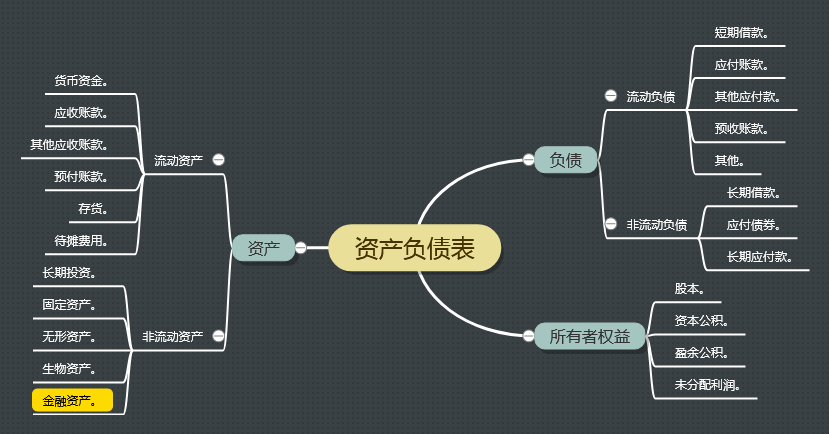

# 一、资产负债表项目

- 资产部分
  - 1-货币资金
  - 2-应收账款
  - 3-其他应收账款
  - 4-预付账款
  - 5-存货
  - 6-待摊费用
  - 7-长期投资
  - 8-固定资产
  - 9-无形资产
  - 10-生物资产
  - 11-金融资产
- 负债部分
  - 1-短期借款
  - 2-应付账款（Accounts Payable）
  - 3-其他应付款（Other Payables）
  - 4-预收账款（Deposit Received）
  - 5-其他
  - 6-长期借款
  - 7-应付债券（Bond Payable）
  - 8-长期应付款（Long-term Payable）
- 所有者权益部分
  - 1-股本（Capital Stock）
  - 2-资本公积（Additional Paid-in Capital）
  - 3-盈余公积（Surplus Zeserve）
  - 4-未分配利润（Retained Earnings）

# 二、脑图

# 三、补充

## 资产、费用以及待摊费用的区别？

资产和费用有一个共同之处就是都得花钱，如果花钱换来的是有用的东西就是资产，花了就没有就是
费用。

有些资产随着企业的正常经营会最终变成一笔费用就叫作“待摊费用”，比如预付的房租、广告费用、
办公用品，甚至企业的开办费。

## 股东权益

股东是不能够随意撤资的，所以对公司来说，股东权益可以说是一个永远都不需要偿还的项目。一个
公司必须给银行还了债、给供应商付了款、给员工发了工资、给税务局交了税之后，才能把剩下来的
东西分给股东，这叫作股东的“剩余求偿权”。这也意味着股东才是这家公司风险和收益的最终承担者。

盈余公积是法律不让我们分配的利润，而未分配利润是企业自己不想分的利润。

# 参考

- 肖星，《一本书读懂财报》，浙江大学出版社。
- [待摊费用](https://wiki.mbalib.com/wiki/%E5%BE%85%E6%91%8A%E8%B4%B9%E7%94%A8)
- [彻底理解“资本性支出”](https://zhuanlan.zhihu.com/p/24462170)
