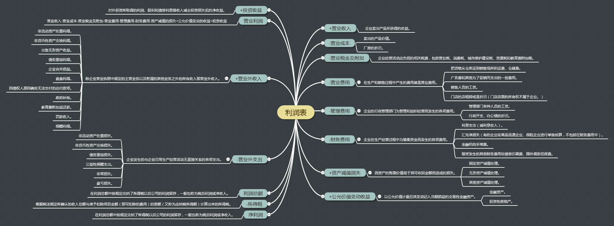

# 一、利润表项目

- [营业收入 +](./1-营业收入.md)
- [营业成本 -](./2-营业成本.md)
- [税金项目 -](./3-税金项目.md)
- [费用项目 -](./4-费用项目.md)
- [资产减值损失 -](./5-资产减值损失.md)
- [公允价值变动收益 +](./6-公允价值变动收益.md)
- [投资收益 +](./7-投资收益.md)
- [营业利润]
- [营业外收入 +](./8-营业外收支.md)
- [营业外支出 -](./8-营业外收支.md)
- [利润总额]
- [所得税费用 -](./9-所得税费用.md)
- [净利润]

如上项目中的利润项目包括：

- 营业利润，企业利润的主要来源，主要由营业收入、营业成本、期间费用、资产减值损失、公允价
值变动净收益、投资净收益构成。
- 利润总额，一家企业在一定时间内到底赚到了多少钱。营业利润+营业外的收入-营业外的支出+补
贴收入+汇兑损益（视该企业是否有外贸业务而定）。
- 净利润，在利润总额中按规定交纳了所得税以后公司的利润留存，一般也称为税后利润或净收入。

《公司理财》里面提到：“经营性利润扣除利息支出和税收就得到净利润。”那么这里的“经营性利润”
相当于国内的“利润总额” + “利息支出”。

# 二、脑图

# 三、补充

## 息税前利润 / EBIT

也称为“经营性净利润”，指在扣除异常项目、非延续性经营活动或是特殊项目前所得的利润。计算EBIT
时只需用“经营活动总收入扣减经营活动总成本”即可得到。分析师都青睐EBIT，因为它可以排除资本
结构（利息支出）和税收的影响，而单独提取盈余的差异部分。

*这里需要注意一下中美报表格式的差异：美国的EBIT可以直接通过总收入-总成本得到，但我国的利
息支出是计入总成本的，因此国内报表的EBIT = 总收入 - 总成本 + 利息支出。*

## 息税及折旧和摊销前的利润 / EBITDA

EBITDA = EBIT + 折旧和摊销。

摊销指的是类似折旧的非现金性支出，不过与折旧相比，它应用于无形资产（如一项专利），而不是
有形资产（如一台机器）。分析师喜欢应用EBITDA指标，因为它将两项非现金项目加回到EBIT中，因
此是税前经营性现金流的更加指标。

# 参考

- 肖星，《一本书读懂财报》，浙江大学出版社。
- 斯蒂芬 A.罗斯，《公司理财》。
