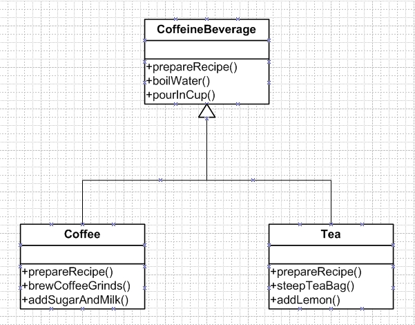

2017年6月10日15:26:35

Template Method（模板方法模式）是一种常见的模式，它在基类中提供基础的方法，达到代码的复
用，并允许子类指定行为。从这点上说它与类的继承有着相同的抽象过程：将公共部分向上抽象一个
层次，不同的是公共部分偏向特定的“算法”。

### 问题的提出

借用《Head First 设计模式》中的例子：当前有两个类Coffee和Tea，分别用来实现“咖啡冲泡”与
“茶冲泡”的过程。它们有着相似的冲泡过程：

咖啡冲泡法 | 茶冲泡法
---- | ----
第一步：把水煮沸 | 第一步：把水煮沸
第二步：用沸水冲泡咖啡 | 第二步：用沸水浸泡茶叶
第三步：把咖啡倒进杯子 | 第三步：把茶倒进杯子
第四步：加糖和牛奶 | 第四步：柠檬

上面的过程可以用下面的类图来描述：


看得出来，其中“第一步”和“第三步”的两个方法相同，是可以共用的，那么该如何解决这个重复的问
题？

### 想到的方案

在把这个问题形象化之后，自己想到的最直接的方法就是一股脑把整个方法抽象出来，并让子类实现
各自不同的地方，恰如最初学习面向对象继承特性时候一样。于是，便有如下类图：


经过测试之后可以工作。在最初想到这种方式的时候其实还不明白它就是所谓的“模板方法”，仅仅是
觉得可以这么做。那书中又是怎样一步一步介绍引出这种模式的呢？拭目以待。

### 书中的方案

1.第一种方式：仅抽象重复部分

书中第一版本的方案也是使用基类，但是它是仅仅将公共方法作为抽象接口。



这种方案将boilWater()与pourInCup()两个方法提升到基类中因此是可以解决这两者的重复问题的。美中不足的是，Coffer与Tea这两个类依然需要分别实现prepareRecipe()这个抽象方法，而它们实现尽管不完全一样，但在某种程度上说也有些重复。

```
Coffee::prepareRecipe()
{
  boilWater();
  brewCoffeeGrinds();
  pourInCup();
  addSugarAndMilk();  
}

Tea::prepareRecipe()
{
  boilWater();
  steepTeaBag();
  pourInCup();
  addLemon();
}
```

看起来，它们的步骤是类似的。这些步骤说得专业点，也就是“算法”。


2.第二种方式：抽象整个算法

书中的第二个方案同样是使用基类，但这个时候它所抽象的不再是boilWater()和pourInCup()这两个方法，而是整个prepareRecipe()。这也是我一开始便想到的处理方式，尽管不知道这就是模板方法模式。

### 模板方法模式

> 模板方法模式在一个方法中定义一个算法的骨架，而将一些步骤延迟到子类中。模板方法使得子类可以在不改变算法结构的情况下，重新定义算法中的某些步骤。


“模板方法”指的就是实现了某种算法的一个方法，它里面定义了一些列步骤，这些步骤可以是抽象的，由子类负责实现。

### 模板方法中的Hook


*疑问*
- 类中的方法包含有virtual等多种类型方法时，如何排列比较好看？


*生词*

- recipe 食谱
- brew 酿造；被冲泡
- grinds 磨碎
- drip 滴水；充满；
- steep 陡峭；泡；浸

*参考*

- [UML 基础: 类图](https://www.ibm.com/developerworks/cn/rational/rationaledge/content/feb05/bell/index.html)
