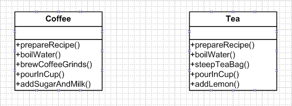
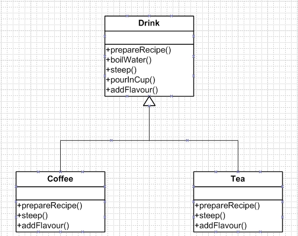
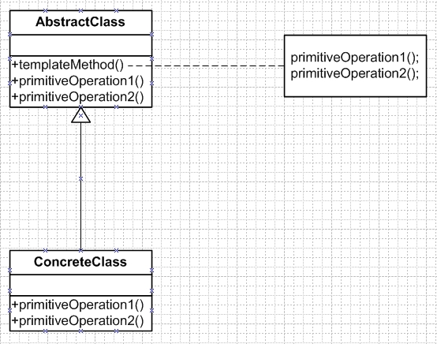

2017年6月10日15:26:35

开始学习template method模式，在学习过程当中会依据如下的安排进行：

- 记录所有不认识的英文生词。
- 以书中的例子作为练习对象，阅读并编码运行。
- 按照“问题”-->“方案1”-->“方案2”-->“最终方案”递进式的发现对应模式的使用场景及作用。
- 同步笔记。

### 问题的出现

当前有两个类Coffee和Tea，它们有着相似的冲泡方法，其中有少数接口有所不同。见如下类图：



可见，其中的两个方法是可以共用的。

### 想到的方案：使用基类

既然上面提到了代码重复的问题，那么实际上我直接可以将重复的方法抽出形成基类：



### 书中的方案

1.书中第一版本的方案也是使用基类，但是它是仅仅将公共方法作为抽象接口。


这种方案将boilWater()与pourInCup()两个方法提升到基类中因此是可以解决这两者的重复问题的。美中不足的是，Coffer与Tea这两个类依然需要分别实现prepareRecipe()这个抽象方法，而它们实现尽管不完全一样，但在某种程度上说也有些重复。

```
Coffee::prepareRecipe()
{
  boilWater();
  brewCoffeeGrinds();
  pourInCup();
  addSugarAndMilk();  
}

Tea::prepareRecipe()
{
  boilWater();
  steepTeaBag();
  pourInCup();
  addLemon();
}
```

看起来，它们的步骤是类似的。这些步骤说得专业点，也就是“算法”。


2.书中的第二个方案同样是使用基类，但这个时候它所抽象的不再是boilWater()和pourInCup()这两个方法，而是整个prepareRecipe()。这也是我一开始便想到的处理方式，尽管不知道这就是模板方法模式。

### 模板方法模式

> 模板方法模式在一个方法中定义一个算法的骨架，而将一些步骤延迟到子类中。模板方法使得子类可以在不改变算法结构的情况下，重新定义算法中的某些步骤。



“模板方法”指的就是实现了某种算法的一个方法，它里面定义了一些列步骤，这些步骤可以是抽象的，由子类负责实现。

*疑问*
- 类中的方法包含有virtual等多种类型方法时，如何排列比较好看？


*生词*

- recipe 食谱
- brew 酿造；被冲泡
- grinds 磨碎
- drip 滴水；充满；
- steep 陡峭；泡；浸

*参考*

- [UML 基础: 类图](https://www.ibm.com/developerworks/cn/rational/rationaledge/content/feb05/bell/index.html)
