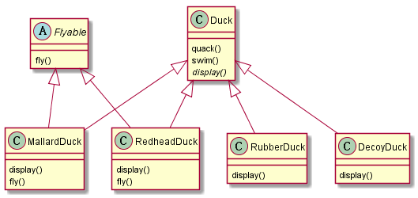
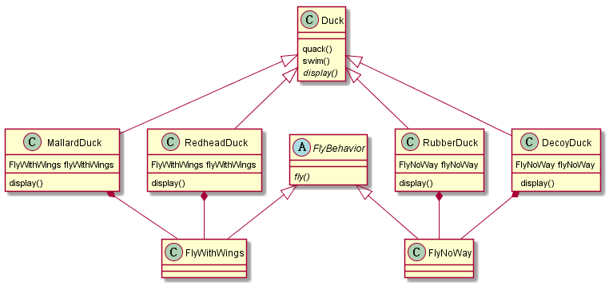
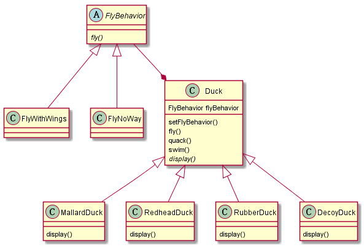

# 继承带来的问题

继承的复用特性很受欢迎，也经常被采用。但继承所带来的问题是无法很好地控制对其修改所带来的
影响，比如下面的设计：

当我们需要为`Duck`新增特性的时候必须顾及到它对所有子类所造成的影响，当给 `Duck`新增行的
为不适合某一子类的时候就会出现问题，而这种需求在现实中是完全可能的。

# 重载父类的方法

为了屏蔽针对父类的修改带给所有子类的影响，一个粗浅的方案是在相关的子类里面重载基类中的方
法，或者直接使用多态。

这种方法是可行的。如果我们考虑这种设计的完美型它还是有瑕疵的，因为这将意味着以后每增加新
的子类必须对父类里面继承的所有方法进行完整性考虑，对于不需要与父类保持一致的方法需要重新
实现。

# 使用接口

另一种可行的方法是将这些多样化的方法剥离成“接口”，强制需要此类方法的每个子类实现自身的版
本：

然而，这种方法看似灵活性很大，确可能引入另一个新的问题：`MallardDuck`和`Redhead`实现的
`fly()`存在着一定重复性。

使用接口面临的代码重复性问题在Java里面没有办法解决，因为Java接口不能实现代码，但这在C++
里面却不是问题，因为C++支持多重继承，尽管它可能违背了继承所应该具有的"is-a"关系。这个时
候我们可以采取《Effective C++》条款39的讨论的方法——“使用private继承”。

只不过这样实现会面临我们正在讨论的这个问题：继承在扩展性上面带来的挑战。关于更好的设计方
案的讨论将把我们带到组合方式。

# 从组合方式到策略模式

我们所讨论的问题是如何解决子类行为多样化的问题，前面所讨论的重载父类的实现，子类实现特定
的接口都不让人满意，此时不妨试试组合的方式，组合拥有继承复用的好处，没有继承带来的包袱。

如上所示，使用组合看起来解决了扩展性问题，需要特定行为的子类可以将特定行为组合进来就可以
了。但它还不够完美：所有的子类在一开始就创建了对应的行为对象，其行为在最初便被固定了下来，
一旦之后需要修改子类的行为，依然需要修改子类本身，因此这里再更进一步让所有子类使用接口来
代替具体实现。

由于应用了接口，因此除了能够解决子类行为多样化的需求之外我们还能够灵活的变更它们的行为，
这种变更仅仅需要调用对应接口（比如`setFlyBehavior()`）即可，这既是策略模式的一种实现。

策略模式的标准定义：

> 策略模式定义了算法簇，分别封装起来，让它们之间可以互相替换，此模式让算法的变化独立于使
用算法的客户。

# 参考

- 《Effective C++》条款 32：确定你的public继承塑模出is-a关系。
